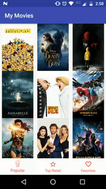
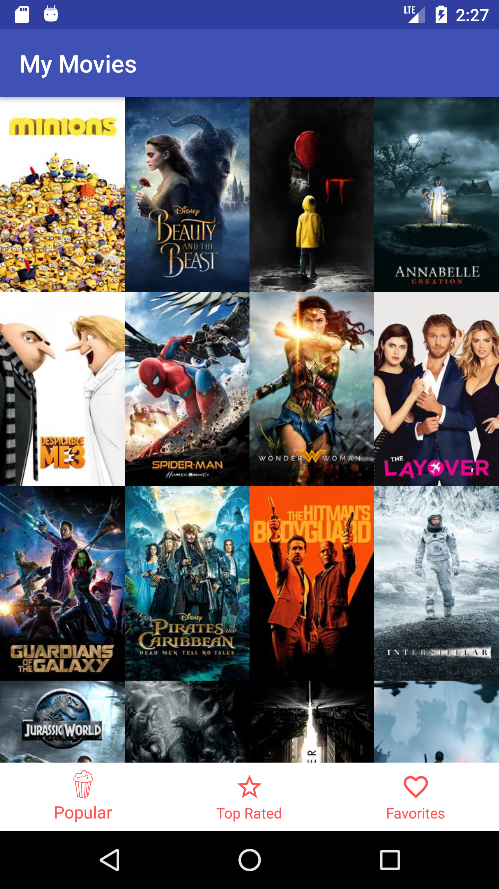
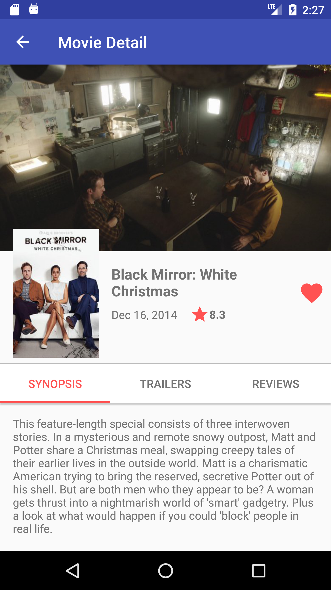
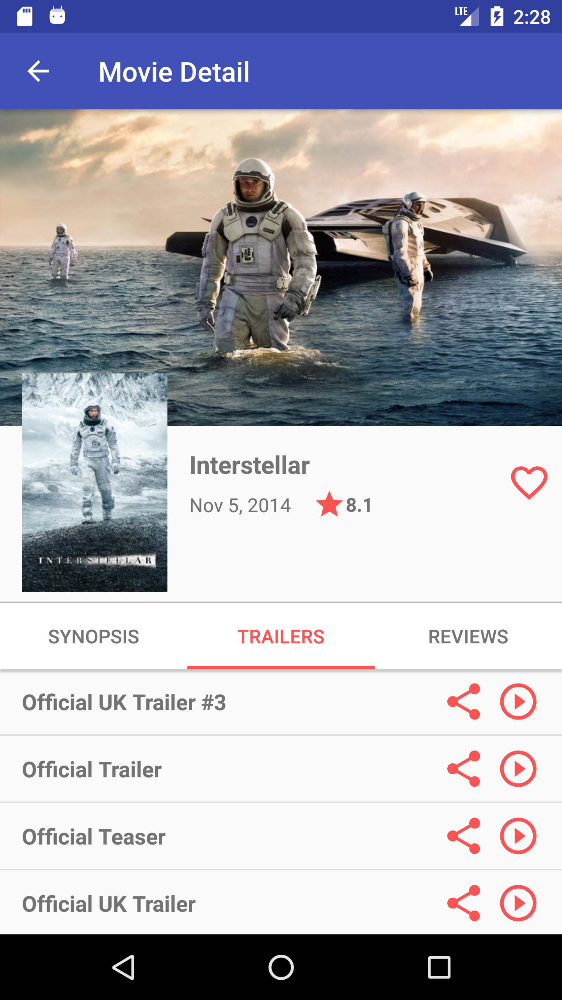
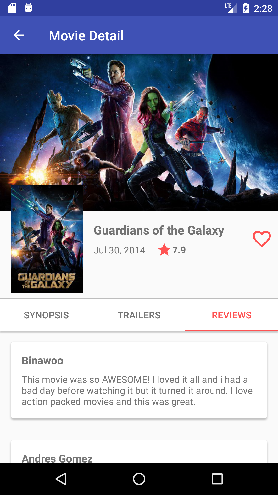
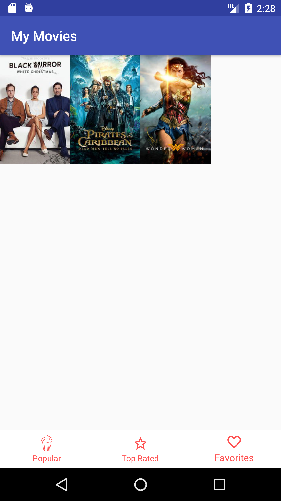
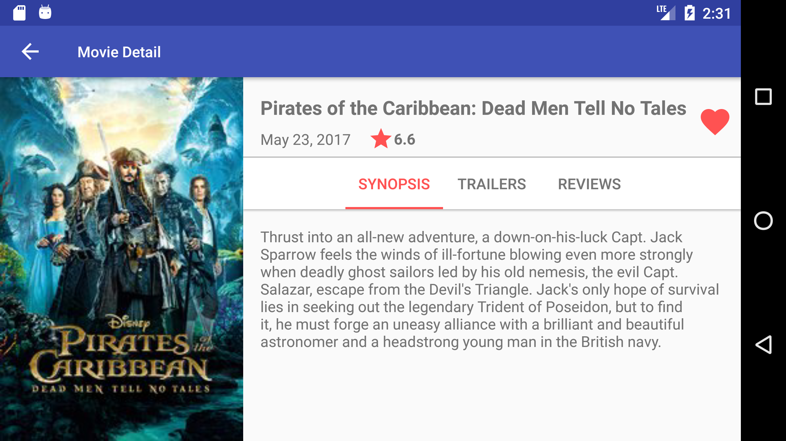

# Popular Movies

Concept app to fetch and list popular movies from The Movie DB api (www.themoviedb.org).

This application was created to exercise a few concepts regarding Android Development.

If you just want to give it a try download the test apk [here](https://drive.google.com/file/d/0BxuNaEVyDit0d0wzcFZ0M2VqR0E/view?usp=sharing).

## Table of Contents
* [Showcase](#showcase)
* [Feature List](#features)
* [Tools and Libs](#tools)
* [TODOs](#todos)
* [Basic Instructions](#instructions)

<a name="showcase"></a>
## Showcase

<p align="center">
  
  
  
  
  
  
  
</p>

<a name="features"></a>
## Feature List

* List Top Rated and Most Popular Movies from The Movie DB Api.
* Display the Movie Details for a selected Movie.
* Allow the user to add movies to favorites.
* Allow user to watch trailers.
* Allow user to share trailers.
* Allow user to read reviews.
* List user's favorites.
* List favorite movie details.
* Offline support for favorite movies.
* Landscape layout for movie details.

<a name="tools"></a>
## Tools and Libs

* RxJava2
* ReactiveNetwork
* Retrofit2
* Picasso
* Gson
* AutoValues
* Butterknife
* Dagger2
* Android Support Libs: 
  * RecyclerView
  * CardView
  * Design Support Library
  * ConstraintLayout
  * Vector Drawables

<a name="todos"/></a>
## ToDos

* Improve error messages displayed to the user.
* Unit and Instrumented Tests.
* Animations

<a name="instructions"></a>
## Basic Instructions

To start developing you should get and api key at www.themoviedb.org.

With the key in hands create app/secrets.properties file. It is a key/value pairs based file and you 
must add keys for Debug and Release versions using the following entries:

```
DEBUG_THE_MOVIE_DB_API_KEY=YOUR_KEY_HERE
RELEASE_THE_MOVIE_DB_API_KEY=YOUR_KEY_HERE
```

You can use the same key for both entries.

The entries will be available in the BuildConfig generated class.


